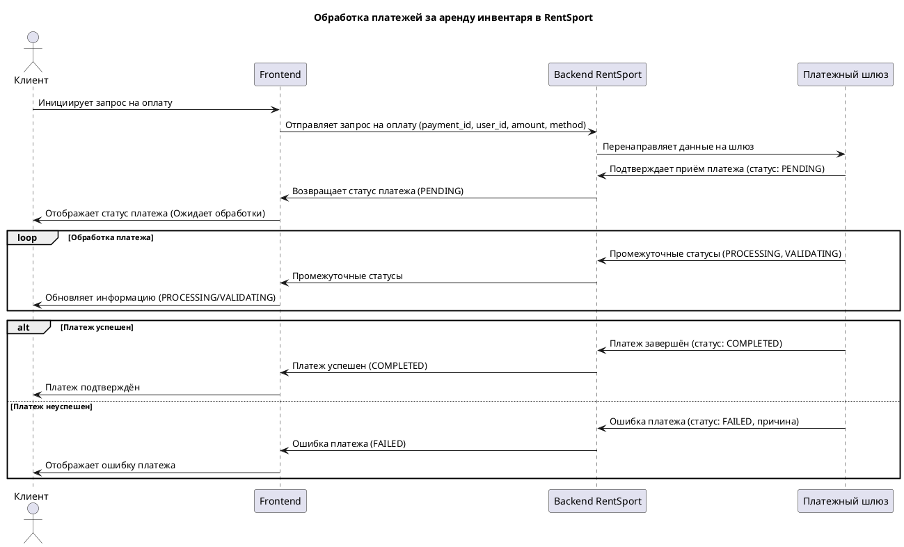
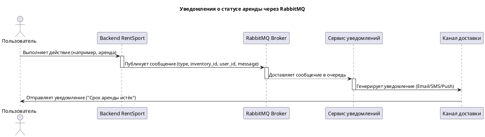

#### Задание:

Необходимо найти в системе хотя бы одно асинхронное взаимодействие, которое возможно реализовать с помощью одной из технологий, рассмотренных на лекциях:

1. RabbitMQ;

2. Apache Kafka;

3. NATS;

4. Websocket;

5. gRPC (только стримы, в т.ч. двунаправленные).

Необходимо обосновать выбор технологии с учётом платформ, стека и характера взаимодействия и описать контракт с помощью следующих средств описания:

6. AsyncAPI (https://www.asyncapi.com/en), если в вашем обмене предусматривается JSON как формат обмена данными;

7. Protocol Buffers — обязателен для gRPC, возможен для всех остальных;

8. Apache Avro — только для Kafka.


#### Решение:

1) В системе RentSport были выбрано использовать асинхронное взаимодействие для обработки платежей. Когда клиент совершает оплату за аренду инвентаря в системе RentSport, время обработки платежа может быть значительным (например, из-за проверки банка, валидации данных или взаимодействия с платёжным шлюзом). Чтобы клиент не ждал завершения операции в реальном времени, процесс оплаты можно реализовать с использованием асинхронного подхода.


**Почему gRPC:**

**Двунаправленное взаимодействие:** Клиент инициирует оплату, а сервер может отправлять промежуточные статусы (например, "Платёж принят", "Обрабатывается банком", "Платёж завершён") - это позволяет клиенту быть в курсе текущего состояния обработки платежа.

Также protocol Buffers (Protobuf) генерирует компактные сообщения, что ускоряет передачу данных и снижает расходы на передачу.

```Plain Text
syntax = "proto3";

service PaymentService {
  // Двунаправленный стриминг для обработки платежей
  rpc ProcessPayment(stream PaymentRequest) returns (stream PaymentStatus);
}

message PaymentRequest {
  string payment_id = 1;        // Уникальный ID платежа
  string user_id = 2;           // ID клиента
  double amount = 3;            // Сумма платежа
  string currency = 4;          // Валюта платежа
  string payment_method = 5;    // Метод оплаты (карта, PayPal и т.д.)
}

message PaymentStatus {
  string payment_id = 1;        // ID платежа
  string status = 2;            // Статус платежа
  string message = 3;           // Сообщение для клиента
}

```

> Почему gRPC: 

> gRPC был выбран по той причине, что нам нужно, чтобы клиент был в курсе своего платежа как можно быстрее, но по сравнению с WebSocket требует меньше затрат. RabbitMQ лучше подходит для уведомлений. Kafka -  избыточен для задачи обработки платежей, так как рассчитан на высокую пропускную способность и огромные объёмы данных

Пример взаимодействия с помощью Sequence диаграммы для этого процесса:





2)Также Асинхронное взаимодействие можно использовать для уведомления об истечении аренды (арендаторам), а уведомления о необходимости обслуживания — арендодателям. RabbitMQ хорошо поддерживает реализацию очередей сообщений, которые могут быть использованы для уведомлений. Уведомления, как правило, не требуют строгого порядка доставки, что соответствует возможностям RabbitMQ. 

Почему RabbitMQ?

Отлично подходит для уведомлений. 

9. Сообщения о статусах не требуют строгого порядка доставки, так как это уведомления, а не критические операции. 

10. RabbitMQ обеспечивает гибкую маршрутизацию уведомлений, например, разные очереди для различных типов пользователей (арендатор, арендодатель).


```Plain Text
asyncapi: 3.0.0
id: 'urn:asyncapi:com.rentsport.notifications:1.0.0'
info:
  title: RentSport Notification Service
  version: 1.0.0
  description: Сервис для отправки уведомлений о статусе аренды и техническом обслуживании.
  
  contact:
    name: RentSport Support
    email: support@rentsport.com
    url: 'https://www.rentsport.com'
  license:
    name: MIT
    url: 'https://opensource.org/licenses/MIT'
  tags:
    - name: notifications
      description: Уведомления о статусе аренды.

defaultContentType: application/json

servers:
  production:
    host: broker.rentsport.com
    protocol: amqp
    description: RabbitMQ Broker для уведомлений.

channels:
  notifications/status:
    address: notifications/status
    messages:
      sendNotification.message:
        contentType: application/json
        payload:
          $ref: '#/components/schemas/Notification'
    description: Канал для уведомлений о статусе аренды.

operations:
  sendNotification:
    action: receive
    channel:
      $ref: '#/channels/notifications~1status'
    summary: Отправка уведомлений о статусе аренды.
    messages:
      - $ref: '#/channels/notifications~1status/messages/sendNotification.message'

components:
  schemas:
    Notification:
      type: object
      properties:
        type:
          type: string
          enum:
            - RENTAL_EXPIRED
            - MAINTENANCE_REQUIRED
        inventory_id:
          type: integer
          description: Уникальный идентификатор инвентаря.
        user_id:
          type: integer
          description: Уникальный идентификатор пользователя.
        message:
          type: string
          description: Текст уведомления.
        timestamp:
          type: string
          format: date-time
          description: Время создания уведомления.
```


Пример взаимодействия с помощью Sequence диаграммы для этого процесса:


