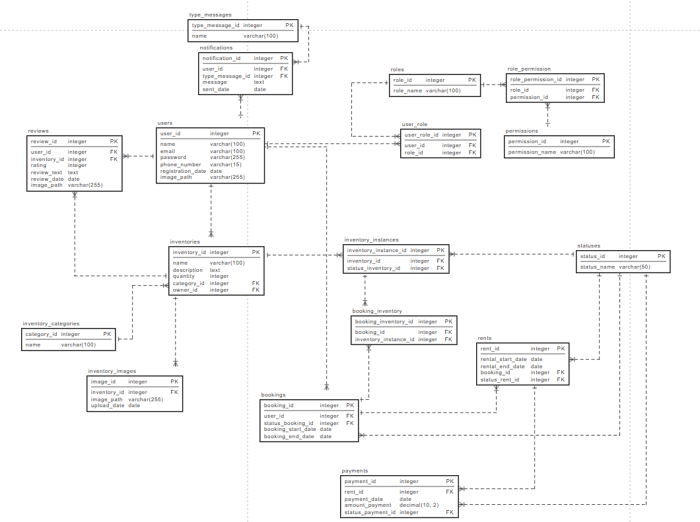

# Физическая модель данных

## Таблица 1. Сущность Категории инвентаря (inventory_category)

|Атрибут|Описание|Тип данных|Значение по умолчанию|Ограничения|Обязательность|
|-|-|-|-|-|-|
|category_id |Идентификатор категории|Целочисленный||PRIMARY KEY|Да| 
|name|Название категории|Текстовый||NOT NULL|Да|

Категории инвентаря решено было вынести в отдельную сущность, так как скорее всего они редко будут пополняться и будут иметь определенный список

### Таблица 2. Сущность Разрешения (permission)

|Атрибут|Описание|Тип данных|Значение по умолчанию|Ограничения|Обязательность|
|-|-|-|-|-|-|
|permission_id|Идентификатор разрешения|Целочисленный||PRIMARY KEY|Да|
|permission_name|Название разрешения|Текстовый||NOT NULL|Да|

### Таблица 3. Сущность Роли (role)

|Атрибут|Описание|Тип данных|Значение по умолчанию|Ограничения|Обязательность|
|-|-|-|-|-|-|
|role_id|Идентификатор роли|Целочисленный||PRIMARY KEY|Да|
|role_name|Название роли|Текстовый||NOT NULL|Да|

### Таблица 4. Сущность Связи ролей и разрешений (role_permission)

|Атрибут|Описание|Тип данных|Значение по умолчанию|Ограничения|Обязательность|
|-|-|-|-|-|-|
|role_permission_id|Идентификатор связи|Целочисленный||PRIMARY KEY|Да|
|role_id|Идентификатор роли|Целочисленный||FOREIGN KEY|Да|
|permission_id|Идентификатор разрешения|Целочисленный||FOREIGN KEY|Да|

### Таблица 5. Сущность Связи пользователей и ролей (user_role)

|Атрибут|Описание|Тип данных|Значение по умолчанию|Ограничения|Обязательность|
|-|-|-|-|-|-|
|user_role_id|Идентификатор связи|Целочисленный||PRIMARY KEY|Да|
|user_id|Идентификатор пользователя|Целочисленный||FOREIGN KEY|Да|
|role_id|Идентификатор роли|Целочисленный||FOREIGN KEY|Да|

Ролевая модель была реализована с помощью описанных ранее 4-х Сущностей. Как минимум в нашей системе будет Клиент(Арендатор), Арендодатель и Администратор. С такой моделью данных мы легко сможем добавлять новые разрешения и роли.

### Таблица 6. Сущность Статусы (statuses)

|Атрибут|Описание|Тип данных|Значение по умолчанию|Ограничения|Обязательность|
|-|-|-|-|-|-|
|status_id|Идентификатор статуса|Целочисленный||PRIMARY KEY|Да|
|status_name|Название статуса|Текстовый||NOT NULL|Да|

Статус было решено использовать для отслеживания: 1) статуса Инвентаря_экземпляра ( доступен, арендован, забронирован, требует ремонта, на ремонте и тд.), 2) статуса бронирования (ожидает оплаты, оплачен, ожидает подтверждения бронирования), 3) статус Оплаты (Ошибка, оплачен...), 4) статус Аренды (ожидает подтверждения бронирования, ожидает выдачи).

### Таблица 7. Сущность Пользователи (users)

|Атрибут|Описание|Тип данных|Значение по умолчанию|Ограничения|Обязательность|
|-|-|-|-|-|-|
|user_id|Идентификатор пользователя|Целочисленный||PRIMARY KEY|Да|
|name|Имя пользователя|Текстовый||NOT NULL|Да|
|email|Электронная почта|Текстовый||UNIQUE|Да|
|password|Пароль|Текстовый||NOT NULL|Да|
|phone_number|Телефонный номер|Текстовый||UNIQUE|Нет|
|registration_date|Дата регистрации|Дата|||Нет|
|image_path|Путь к изображению(URL)|Текстовый|||Нет|

### Таблица 8. Сущность Бронирования (bookings)

|Атрибут|Описание|Тип данных|Значение по умолчанию|Ограничения|Обязательность|
|-|-|-|-|-|-|
|booking_id|Идентификатор бронирования|Целочисленный||PRIMARY KEY|Да|
|user_id|Идентификатор пользователя|Целочисленный||FOREIGN KEY|Да|
|status_booking_id|Идентификатор статуса бронирования|Целочисленный||FOREIGN KEY|Да|
|booking_start_date|Дата начала бронирования|Дата||NOT NULL|Да|
|amount_payment|Сумма оплаты|Десятичный|||Да|

То есть при бронировании создаётся запись аренды инвентаря и бронирования, при этом статус аренды и бронирования может отличаться, например, бронь - "оплачена", аренда - "ожидает выдачи". Такое может произойти, если клиент оплатил заказ на аренду, но еще не совершил ее. 

### Таблица 9. Сущность Инвентарь (inventories)

|Атрибут|Описание|Тип данных|Значение по умолчанию|Ограничения|Обязательность|
|-|-|-|-|-|-|
|inventory_id|Идентификатор инвентаря|Целочисленный||PRIMARY KEY|Да|
|name|Название инвентаря|Текстовый||NOT NULL|Да|
|description|Описание|Текстовый|||Нет|
|quantity|Количество|Целочисленный|||Да|
|category_id|Категория|Целочисленный||FOREIGN KEY|Да|
|owner_id|Владелец|Целочисленный||FOREIGN KEY|Да|

### Таблица 10. Сущность Экземпляры инвентаря (inventories_instances)

|Атрибут|Описание|Тип данных|Значение по умолчанию|Ограничения|Обязательность|
|-|-|-|-|-|-|
|inventory_instance_id|Идентификатор экземпляра инвентаря|Целочисленный||PRIMARY KEY|Да|
|inventory_id|Идентификатор инвентаря|Целочисленный||FOREIGN KEY|Да|
|status_inventory_id|Идентификатор статуса инвентаря|Целочисленный||FOREIGN KEY|Да|

Чтобы мы сразу могли внести ,например, 100 пар кроссовок фирмы Nike, но при этом могли отслеживать каждую пару кроссовок.

### Таблица 11. Сущность Типы сообщений (type_message)

|Атрибут|Описание|Тип данных|Значение по умолчанию|Ограничения|Обязательность|
|-|-|-|-|-|-|
|type_message_id|Идентификатор типа сообщения|Целочисленный||PRIMARY KEY|Да|
|name|Название типа сообщения|Текстовый||NOT NULL|Да|

Например, уведомление пользователя об окончании аренды или уведомление Арендодателя для починки инвентаря.

### Таблица 12. Сущность Уведомления (notifications)

|Атрибут|Описание|Тип данных|Значение по умолчанию|Ограничения|Обязательность|
|-|-|-|-|-|-|
|notification_id|Идентификатор уведомления|Целочисленный||PRIMARY KEY|Да|
|user_id|Идентификатор пользователя|Целочисленный||FOREIGN KEY|Да|
|type_message_id|Идентификатор типа сообщения|Целочисленный||FOREIGN KEY|Да|
|message|Сообщение|Текстовый|||Да|
|sent_date|Дата отправки|Дата|||Да|

### Таблица 13. Сущность Платежи (payments)

|Атрибут|Описание|Тип данных|Значение по умолчанию|Ограничения|Обязательность|
|-|-|-|-|-|-|
|payment_id|Идентификатор платежа|Целочисленный||PRIMARY KEY|Да|
|rent_id|Идентификатор аренды|Целочисленный||FOREIGN KEY|Да|
|payment_date|Дата платежа|Дата|||Да|
|amount_payment|Общая сумма|Десятичный|||Нет|
|status_payment_id|Идентификатор статуса платежа|Целочисленный||FOREIGN KEY|Да|

### Таблица 14. Сущность Отзывы (reviews)

|Атрибут|Описание|Тип данных|Значение по умолчанию|Ограничения|Обязательность|
|-|-|-|-|-|-|
|review_id|Идентификатор отзыва|Целочисленный||PRIMARY KEY|Да|
|user_id|Идентификатор пользователя|Целочисленный||FOREIGN KEY|Да|
|inventory_id|Идентификатор инвентаря|Целочисленный||FOREIGN KEY|Да|
|rating|Оценка|Целочисленный||CHECK (1-5)|Да|
|review_text|Текст отзыва|Текстовый|||Нет|
|review_date|Дата отзыва|Дата|||Да|
|image_path|Путь к изображению(URL)|Текстовый|||Нет|

Для того, чтобы отражать отзывы на инвентарь, при чем они будут именно что не на конкретный экземпляр инвентаря. То есть рейтинг ставится кроссовкам НАЙК Джордан 1, а не конкретным кроссовкам НАЙК Джордан 1 с серийным номером 007.

### Таблица 15. Сущность Связь бронирования и инвентаря (booking_inventory)

|Атрибут|Описание|Тип данных|Значение по умолчанию|Ограничения|Обязательность|
|-|-|-|-|-|-|
|booking_inventory_id|Идентификатор связи|Целочисленный||PRIMARY KEY|Да|
|booking_id|Идентификатор бронирования|Целочисленный||FOREIGN KEY|Да|
|inventory_instance_id|Идентификатор экземпляра инвентаря|Целочисленный||FOREIGN KEY|Да|

### Таблица 16. Сущность Аренды (rents)

|Атрибут|Описание|Тип данных|Значение по умолчанию|Ограничения|Обязательность|
|-|-|-|-|-|-|
|rent_id|Идентификатор аренды|Целочисленный||PRIMARY KEY|Да|
|rental_start_date|Дата начала аренды|Дата||NOT NULL|Да|
|rental_end_date|Дата окончания аренды|Дата||NOT NULL|Да|
|booking_id|Идентификатор бронирования|Целочисленный||FOREIGN KEY|Да|
|status_rent_id|Идентификатор статуса аренды|Целочисленный||FOREIGN KEY|Да|

Важно отметить, что по желанию бизнеса, нельзя внести в систему аренду без бронирования, это делается для того, чтобы пользователь начал пользоваться системой и понял какая она хорошая. В случае, если бизнес захочет делать аренды без бронирований, то нужно будет изменить некоторые моменты в БД.

### Таблица 17. Сущность Фотографии инвентаря (inventory_images)

|Атрибут|Описание|Тип данных|Значение по умолчанию|Ограничения|Обязательность|
|-|-|-|-|-|-|
|image_id|Идентификатор фото|Целочисленный||PRIMARY KEY|Да|
|inventory_id|Идентификатор инвентаря|Целочисленный||FOREIGN KEY|Да|
|image_path|Путь к изображению (URL)|Текстовый||NOT NULL|Да|
|upload_date|Дата и время загрузки|Дата||NOT NULL|Да|

