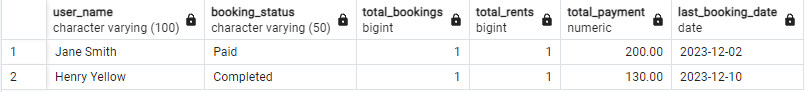

# Отчет по бронированиям и аренде пользователей с информацией о платежах и статусах.

## Задание 3: 

В этом задании нужно описать бизнес-кейс использования какого-либо регулярного отчета на данных из вашей системы и написать для него SQL-скрипт.

SQL-скрипт должен удовлетворять нескольким правилам:

1. Содержит inner и left join

2. Содержит подзапрос

3. Содержит сортировку

4. Содержит group by и агрегатную функцию

## Решение:

Анализ бронирований и аренды по пользователям с информацией о платежах и статусах.

Информация в отчете: 

- Пользователей с бронированиями и арендой,

- Сколько предметов они забронировали и арендовали,

- Общую сумму оплат, которую они внесли,

- Учитывает только завершенные или оплаченные бронирования и аренды.

Как можно использовать: 

- **Аналитика для бизнеса:** Позволяет владельцу системы отслеживать активность пользователей, общие доходы и вовлеченность.

- **Управление пользователями:** Помогает выявить наиболее активных клиентов.

- **Отдел поддержки:** Анализирует, сколько пользователей завершили или оплатили свои бронирования.

```Plain Text
SELECT 
    u.name AS user_name,
    s.status_name AS booking_status,
    COUNT(DISTINCT b.booking_id) AS total_bookings,
    COUNT(DISTINCT r.rent_id) AS total_rents,
    SUM(p.amount_payment) AS total_payment,
    MAX(b.booking_start_date) AS last_booking_date
FROM users u
INNER JOIN bookings b ON u.user_id = b.user_id
LEFT JOIN rents r ON b.booking_id = r.booking_id
LEFT JOIN payments p ON r.rent_id = p.rent_id
INNER JOIN statuses s ON b.status_booking_id = s.status_id
WHERE b.status_booking_id IN (
    SELECT status_id
    FROM statuses
    WHERE status_name IN ('Paid', 'Completed')
) -- Подзапрос: фильтрация только оплаченных или завершенных статусов
GROUP BY 
    u.name, 
    s.status_name
ORDER BY 
    total_payment DESC, 
    last_booking_date DESC;
```

Пример результата: 



