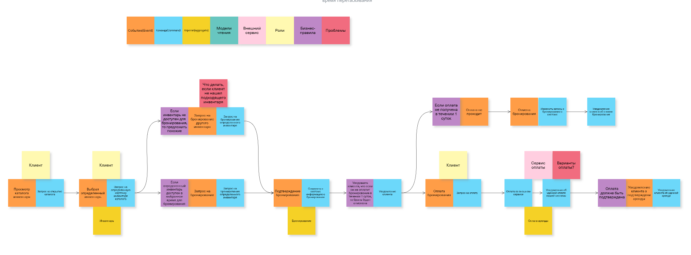

### **1. Классификация стейкхолдеров по матрице RACI: Функция** онлайн-бронирование инвентаря

|||||||||
|-|-|-|-|-|-|-|-|
|Активность|Заказчик|Продукт менеджер|Команда разработки|Аналитики|Пользователи системы (клиенты)|Арендодатели|Партнеры по интеграции|
|Сбор требований|C|A|C|R|C|C|I|
|Проектирование ТЗ(ФТ и НФТ)|C|A|C|R|I|I|I|
|Проектирование архитектуры системы|C|A|R|C|I|I|C|
|Прототипирование интерфейса бронирования|C|A|C|R|C|C|I|
|Разработка системы|C|A|R|C|I|I|I|
|Интеграция с системой оплаты|I|A|R|C|I|I|C|
|Тестирование системы бронирования|I|A|R|C|С|С|I|

### Роли стейкхолдеров в активностях

1. **Заказчик**: Участвует в сборе требований, в последствии утверждает ТЗ, подтверждает архитектуру, дает обратную связь на прототипы, информирован о ходе разработки и тестирования. Если заказчику что-то не понравится на любом из этапов, то это может привести к необходимости доработки или переделки.

2. **Продукт менеджер**: Координирует процесс сбора требований и разработки, утверждает ТЗ и прототипы. Несет ответственность за выполнения сроков и качество выполнение во всех рассмотренных процессах.

3. **Команда разработки**: Реализует технические решения (разрабатывает систему и проводит интеграцию с системой оплаты). Также участвует в тестировании, исправляет ошибки и вносит изменения.

4. **Аналитики**: Систематизируют и документируют требования, участвуют в проектировании ТЗ, оценивают архитектурные решения, проектирует прототип интерфейса. Также анализируют результаты тестирования.

5. **Пользователи (клиенты)**: Предоставляют обратную связь на этапе сбора требований, участвуют в тестировании прототипов и готовой системы. Клиентам предлагается поучаствовать в этих этапах, чтобы убедиться, что функционал соответствует их ожиданиям.

6. **Арендодатели**: Участвуют в обсуждении требований и обратной связи на каждом этапе, чтобы гарантировать, что система отвечает их нуждам, чтобы снискать при выпуске системы успех.

7. **Партнёры по интеграции**: Консультируются по вопросам интеграции с другими системами, поэтому они участвуют проектировании системы. В данном случает участвуют только платежные сервисы.

### **2. Составление списка вопросов для интервью:** онлайн-бронирование инвентаря

8. Есть ли у вас опыт работы с другими системами бронирования? Если да, то с какими проблемами вы сталкиваетесь при процессе бронирования инвентаря? (Цель: выявить существующие на данный момент недостатки и проблемы) 

9. Как вы планируете использовать систему для управления бронированиями? (Цель: понять сценарии использования бронирования инвентаря)

10. Какой функционал онлайн-бронирования вы считаете наиболее важным для вашей работы? (Цель: понять приоритетные функции, которые стейкхолдеры ожидают от системы)  

11. Нужна ли вам возможность изменения или отмены бронирования? Если да, то как вы представляете этот процесс? (Цель: узнать ожидания относительно гибкости в управлении процессом бронированиями) 

12. Какой интерфейс вам кажется наиболее удобным для осуществления онлайн-бронирования? (Цель: Собрать информацию о предпочтениях стейкхолдеров и пользовательский опыт) 

13. Какую информацию об инвентаре вы считаете важной для отображения при бронировании? (Цель: выяснить, какие данные о каждом предмете инвентаря важны для пользователей. Более подробно узнать каким видят стейкхолдеры интерфейс определенной формы)

14. Какие фильтры были бы вам полезны для поиска нужного инвентаря? (Цель: выяснить, какие фильтрации для инвентаря могут упростить процесс поиска)

15. Как вы хотели бы получать уведомления о статусе бронирования? (Цель: Понять предпочтения в отношении методов уведомлений)

16. Каковы ваши ожидания относительно интеграции с другими системами (например, системы оплаты)? (Цель: Выяснить требования к интеграции, узнать какие еще системы можно интегрировать помимо системы оплаты)

17. Какие данные о пользователях вы хотели бы собирать во время процесса бронирования? (Цель: Определить ключевую информацию, необходимую для эффективного анализа)

### **3. Построение Event Storming для бизнес-процесса**

[https://unidraw.io/board/311a15fd44d8f0d868c2](https://unidraw.io/board/311a15fd44d8f0d868c2)

