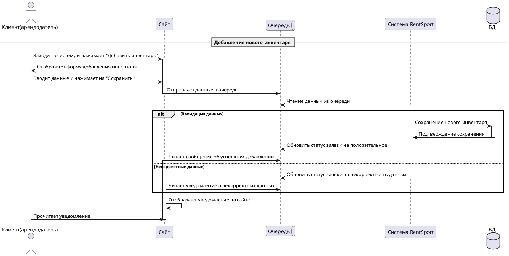

# Sequence диаграмма Добавление нового инвентаря

```plantuml

@startuml

actor "Клиент(арендодатель)" as c

participant "Сайт" as s

queue "Очередь" as q

participant "Система RentSport" as crm

database "БД" as db

== Добавление нового инвентаря ==

c -> s: Заходит в систему и нажимает "Добавить инвентарь"

activate s

s -> c: Отображает форму добавления инвентаря

c -> s: Вводит данные и нажимает на "Сохранить"

s -> q: Отправляет данные в очередь

deactivate s

crm -> q: Чтение данных из очереди

activate crm

alt Валидация данных

crm -> db: Сохранение нового инвентаря

activate db

db -> crm: Подтверждение сохранения

deactivate db

crm -> q: Обновить статус заявки на положительное

s -> q: Читает сообщение об успешном добавлении

activate s

else Некорректные данные

crm -> q: Обновить статус заявки на некорректность данных

deactivate crm

s -> q: Читает уведомление о некорректных данных

end

s -> s: Отображает уведомление на сайте

c -> s: Прочитает уведомление

deactivate s

@enduml

```

## Описание алгоритма
