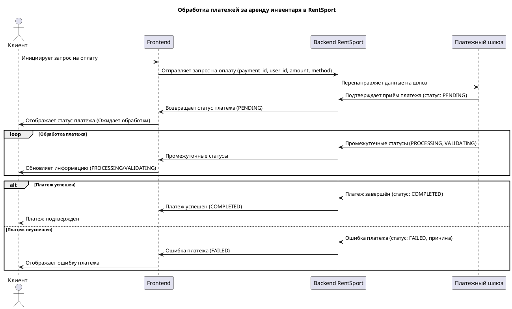

# Sequence Обработка платежей

```plantuml

@startuml

title Обработка платежей за аренду инвентаря в RentSport

actor Client as "Клиент"

participant Frontend as "Frontend"

participant Backend as "Backend RentSport"

participant PaymentGateway as "Платежный шлюз"

Client -> Frontend: Инициирует запрос на оплату

Frontend -> Backend: Отправляет запрос на оплату (payment_id, user_id, amount, method)

Backend -> PaymentGateway: Перенаправляет данные на шлюз

PaymentGateway -> Backend: Подтверждает приём платежа (статус: PENDING)

Backend -> Frontend: Возвращает статус платежа (PENDING)

Frontend -> Client: Отображает статус платежа (Ожидает обработки)

loop Обработка платежа

Backend <- PaymentGateway: Промежуточные статусы (PROCESSING, VALIDATING)

Backend -> Frontend: Промежуточные статусы

Frontend -> Client: Обновляет информацию (PROCESSING/VALIDATING)

end

alt Платеж успешен

PaymentGateway -> Backend: Платеж завершён (статус: COMPLETED)

Backend -> Frontend: Платеж успешен (COMPLETED)

Frontend -> Client: Платеж подтверждён

else Платеж неуспешен

PaymentGateway -> Backend: Ошибка платежа (статус: FAILED, причина)

Backend -> Frontend: Ошибка платежа (FAILED)

Frontend -> Client: Отображает ошибку платежа

end

@enduml

```

## Описание алгоритма
