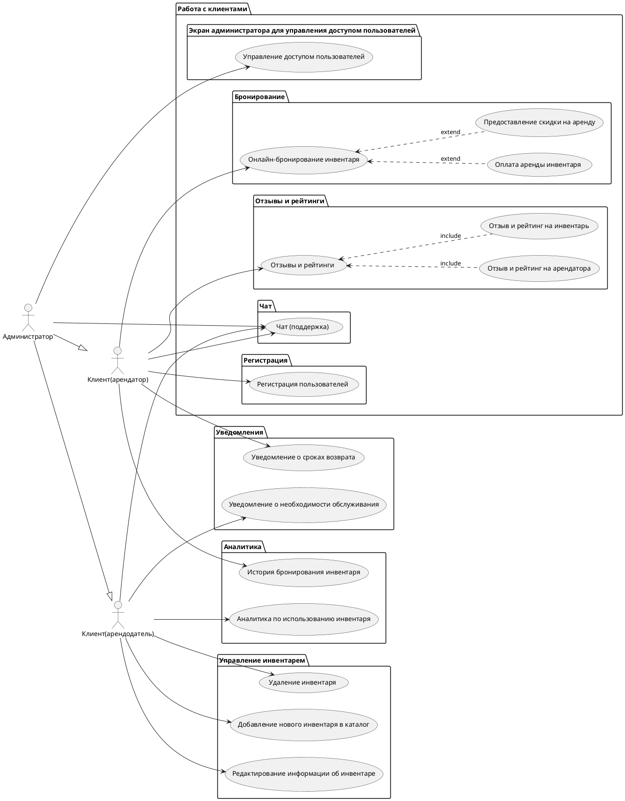

# Use Case diagramm v1 (Меньше категорий для mvp)

```plantuml

@startuml

left to right direction

actor Администратор as A1

actor "Клиент(арендатор)" as K1

actor "Клиент(арендодатель)" as K2

package "Управление инвентарем" {

usecase UC1 as "Добавление нового инвентаря в каталог"

usecase UC2 as "Редактирование информации об инвентаре"

usecase UC3 as "Удаление инвентаря"

}

package "Работа с клиентами" {

package "Бронирование" {

usecase UC4 as "Онлайн-бронирование инвентаря"

usecase UC15 as "Оплата аренды инвентаря"

usecase UC16 as "Предоставление скидки на аренду"

}

package "Отзывы и рейтинги" {

usecase UC11 as "Отзывы и рейтинги"

usecase UC17 as "Отзыв и рейтинг на арендатора"

usecase UC18 as "Отзыв и рейтинг на инвентарь"

}

package "Чат" {

usecase UC12 as "Чат (поддержка)"

}

package "Регистрация" {

usecase UC14 as "Регистрация пользователей"

}

package "Экран администратора для управления доступом пользователей" {

usecase UC19 as "Управление доступом пользователей"

}

}

package "Уведомления" {

usecase UC5 as "Уведомление о сроках возврата"

usecase UC6 as "Уведомление о необходимости обслуживания"

}

package "Аналитика" {

usecase UC9 as "История бронирования инвентаря"

usecase UC8 as "Аналитика по использованию инвентаря"

}

A1 --> UC12

A1 --> UC19

K1 --> UC4

K1 --> UC5

K1 --> UC11

K1 --> UC12

K1 --> UC14

K1 --> UC9

K2 --> UC1

K2 --> UC2

K2 --> UC3

K2 --> UC6

K2 --> UC8

K2 --> UC12

UC4 <.. UC15: extend

UC4 <.. UC16: extend

UC11 <.. UC17: include

UC11 <.. UC18: include

A1 --|> K1

A1 --|> K2

@enduml

```

## Описание алгоритма
